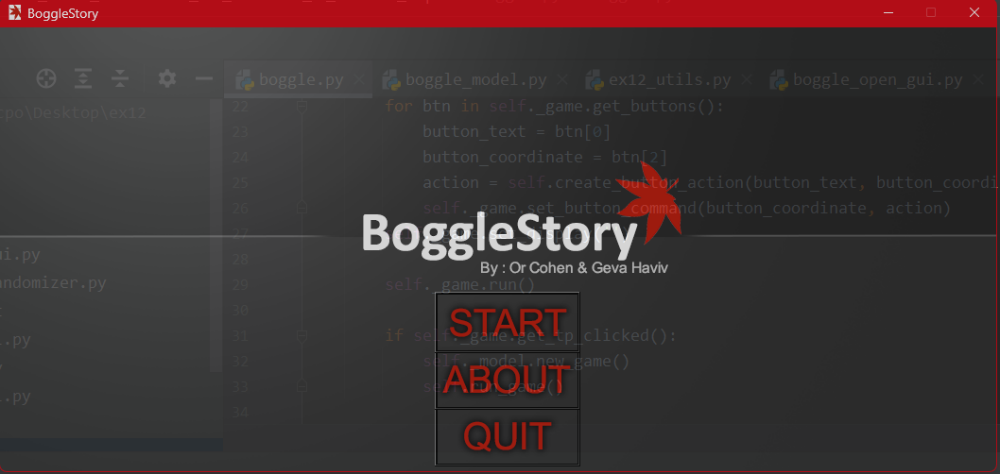
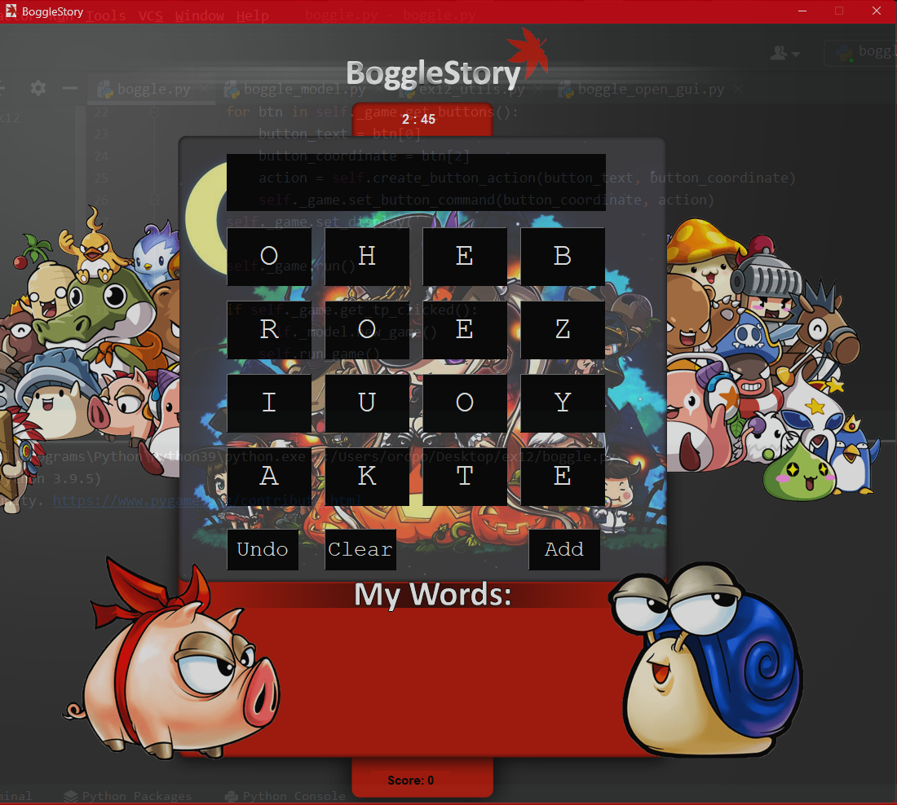

# Boggle Story

Boggle Story is an engaging word-making game that challenges players' vocabulary skills. In this game, players are given a set of jumbled letters and must create as many words as possible within three minutes. The longer the words created, the higher the score!

## Features
- Beautiful graphical user interface and immersive sounds that enhance the gaming experience.
- Gameplay inspired by the classic game Boggle.

## Gameplay Explanation
For a detailed explanation of the gameplay, please visit [this link](https://www.wikihow.com/Play-Boggle).

## Usage

Follow the steps below to get started with Boggle Story:

1. Clone this repository to your local machine.
2. Install the required libraries: `pip install pygame`, `pip install tkinter`.
3. Open your terminal or command prompt.
4. Navigate to the project directory.
5. Run the following command to start playing Boggle Story: `python boggle.py`.

## Libraries Used
- Pygame
- Tkinter
- Style_sheet
- Random
- Time

## Credits
This project was developed by Or Cohen and Geva Haviv.

## License
This project is licensed under the MIT License. Feel free to use and modify the code as per the terms of the license.
